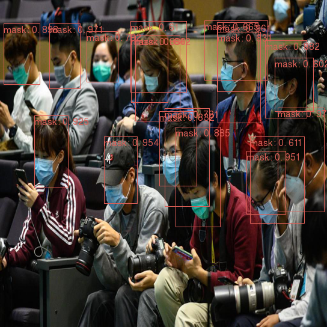
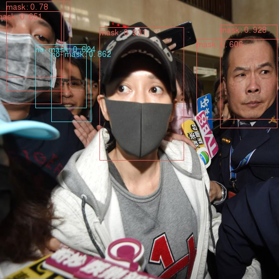
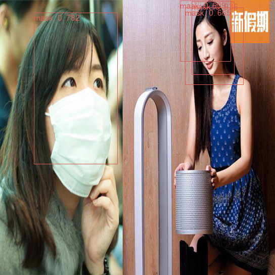

# 物体検出（pytorch）

## 概要
物体検出用のモデルを pytorch で再現実装する。実装を行ったのは以下のモデル。
* YoloV2 (https://arxiv.org/abs/1612.08242)

## データセット
使用したデータセットは以下。PascalVOC, COCOは学習済み重みファイルを使用した学習・評価の動作確認に使用した。
* PascalVOC
* COCO
* Mask Wearing
    * https://public.roboflow.com/object-detection/mask-wearing

## 評価結果
Mask Wearing データセットでの学習の評価結果は以下の通りである。
### yolov2, size = 416
```
+---------+-------------+-------------+-------------+-------------+-------------+-------------+-------------+-------------+-------------+-------------+--------+
|         |   th = 0.50 |   th = 0.55 |   th = 0.60 |   th = 0.65 |   th = 0.70 |   th = 0.75 |   th = 0.80 |   th = 0.85 |   th = 0.90 |   th = 0.95 |   mean |
+=========+=============+=============+=============+=============+=============+=============+=============+=============+=============+=============+========+
| mask    |       0.605 |       0.563 |       0.537 |       0.442 |       0.369 |       0.197 |       0.112 |       0.026 |       0.001 |           0 |  0.285 |
+---------+-------------+-------------+-------------+-------------+-------------+-------------+-------------+-------------+-------------+-------------+--------+
| no-mask |       0.197 |       0.147 |       0.118 |       0.118 |       0.084 |       0.059 |       0     |       0     |       0     |           0 |  0.072 |
+---------+-------------+-------------+-------------+-------------+-------------+-------------+-------------+-------------+-------------+-------------+--------+
| AP      |       0.401 |       0.355 |       0.327 |       0.28  |       0.227 |       0.128 |       0.056 |       0.013 |       0.001 |           0 |  0.179 |
+---------+-------------+-------------+-------------+-------------+-------------+-------------+-------------+-------------+-------------+-------------+--------+
```

### yolov2, size = 544
```
+---------+-------------+-------------+-------------+-------------+-------------+-------------+-------------+-------------+-------------+-------------+--------+
|         |   th = 0.50 |   th = 0.55 |   th = 0.60 |   th = 0.65 |   th = 0.70 |   th = 0.75 |   th = 0.80 |   th = 0.85 |   th = 0.90 |   th = 0.95 |   mean |
+=========+=============+=============+=============+=============+=============+=============+=============+=============+=============+=============+========+
| mask    |       0.584 |       0.575 |       0.536 |       0.485 |       0.408 |       0.281 |       0.139 |       0.039 |       0.003 |           0 |  0.305 |
+---------+-------------+-------------+-------------+-------------+-------------+-------------+-------------+-------------+-------------+-------------+--------+
| no-mask |       0.201 |       0.201 |       0.201 |       0.201 |       0.201 |       0.152 |       0.059 |       0.059 |       0     |           0 |  0.127 |
+---------+-------------+-------------+-------------+-------------+-------------+-------------+-------------+-------------+-------------+-------------+--------+
| AP      |       0.392 |       0.388 |       0.369 |       0.343 |       0.304 |       0.216 |       0.099 |       0.049 |       0.002 |           0 |  0.216 |
+---------+-------------+-------------+-------------+-------------+-------------+-------------+-------------+-------------+-------------+-------------+--------+
```

## 推論結果
人の顔に対してBBOXが描画できている。ただし人が密集している場面ではBBOXの重複や位置のズレが見られる。



no-mask はデータが少ないこともあり、推論に失敗することが多かった。


## 実行方法
1. 環境構築
* 学習は Google Colab で実施した。
* それ以外でスクリプトを動作する場合は、リポジトリ直下で
    ```
    pip install -e .
    ```
    とすれば必要なライブラリが import できる。

1. 学習
学習・評価・推論は src/process.py で行う。学習は以下で実行
```
python src/process.py train {キー}
```
キーは重みファイルを参照

1. 推論
以下で実行
```
python src/process.py inference {キー}
```
キーは重みファイルを参照

1. 評価
以下で実行
```
python src/process.py evaluate {キー}
```
キーは重みファイルを参照

